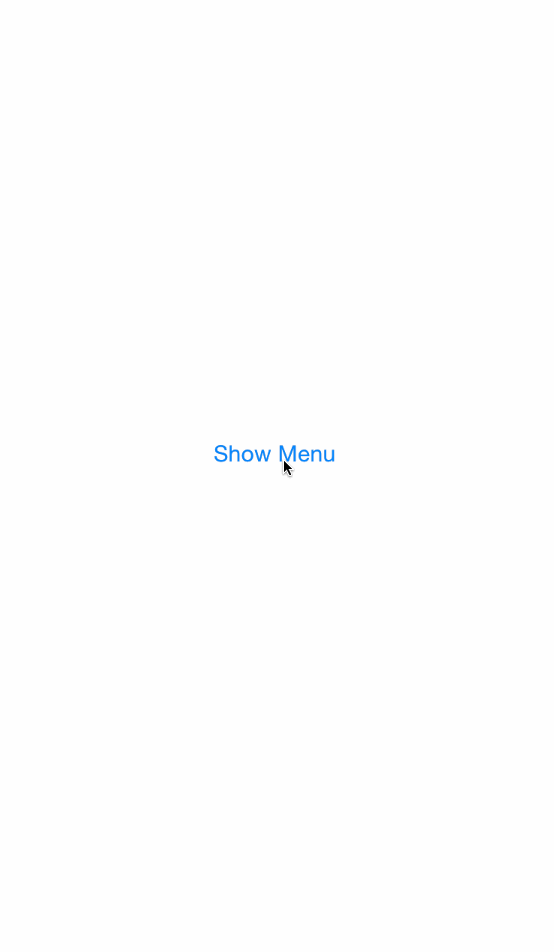

# DWNavMenu
A highly customizable UIActionSheet style menu with simple navigation and block handling



This class is a simple navigation menu in the style of a UIActionSheet. This class makes it easy to create seamless menu funnels using block handling and simple navigation. Includes all the features of a UIActionSheet, and all navigation handling is done internally. Also supports landscape and portrait orientation changes. All button sizes, fonts, colors, spacing, and et cetera is all customizable and can be found in the DWNavMenu header file.

Note you only need to import the DWNavMenu header file, but you'll need all the source files included in your project.

CocoaPods
==================
```
pod 'DWNavMenu'
```

Usage
==================
You create a menu by calling the class or instance method initializer. You can add buttons with the DWNavMenuAction class. This class has only one initializer where you can include the button title, if it will dismiss the menu or not, and the block to invoke when it's tapped.

Here is an example of creating a DWNavMenu instance with only a cancel button. Tapping cancel will always dismiss the menu by default, however you can optionally set a block for cancelAction to perform an additional action.
```objective-c
DWNavMenu *someMenu = [DWNavMenu navMenuWithTitle:@"Sample Menu"
                                cancelButtonTitle:@"Cancel"
                                     cancelAction:nil
                                          buttons:nil];
```

Here is an example of adding a button to the DWNavMenu. Buttons are created by passing DWNavMenuActions to the buttons parameter
```objective-c
DWNavMenu *someMenu = [DWNavMenu navMenuWithTitle:@"Sample Menu"
                                cancelButtonTitle:@"Cancel"
                                     cancelAction:nil
                                          buttons:
                       [DWNavMenuAction menuActionWithTitle:@"This is a button"
                                          shouldDismissMenu:YES
                                               blockHandler:^{
                                                   NSLog(@"This button was tapped");
                                               }], nil];
```

If you wanted to push the last DWNavMenu onto another DWNavMenu's navigation stack, you would do it like so:
```objective-c
self.mainMenu = /* An already created DWNavMenu */
        
[self.mainMenu pushNavMenu:someMenu animated:YES];
```

All pushed DWNavMenus will automatically add a back button that will pop the menu off the navigation stack for you. However if you wanted to perform this manually simply call popNavMenu:
```objective-c
[someMenu popNavMenuAnimated:YES];
```

You can also add a destructive style button, for instance if you wanted to show a delete or remove button with visual warning separate from other buttons.
```objective-c
   self.mainMenu.destructiveMenuAction = [DWNavMenuAction menuActionWithTitle:@"Delete"
                                                     shouldDismissMenu:YES
                                                          blockHandler:^{
                                                              NSLog(@"Delete button was tapped");
                                                          }];
```
